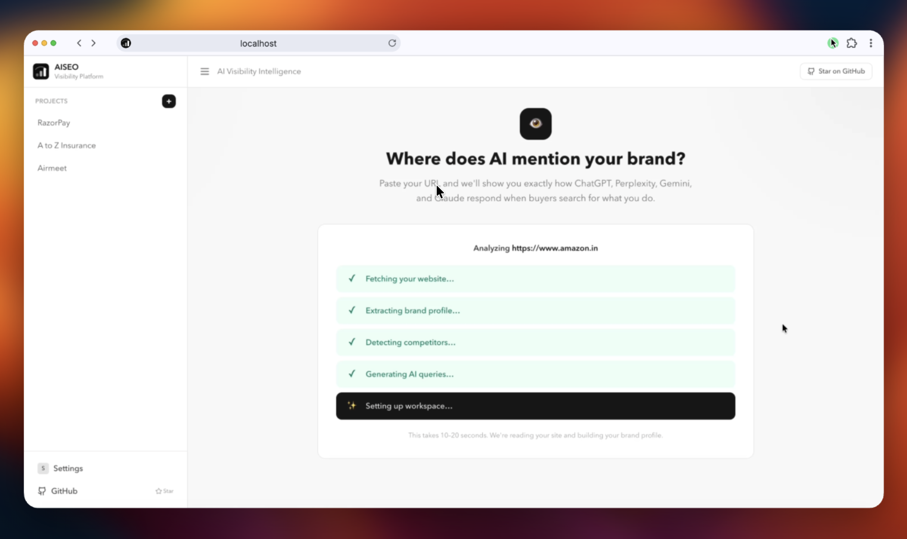
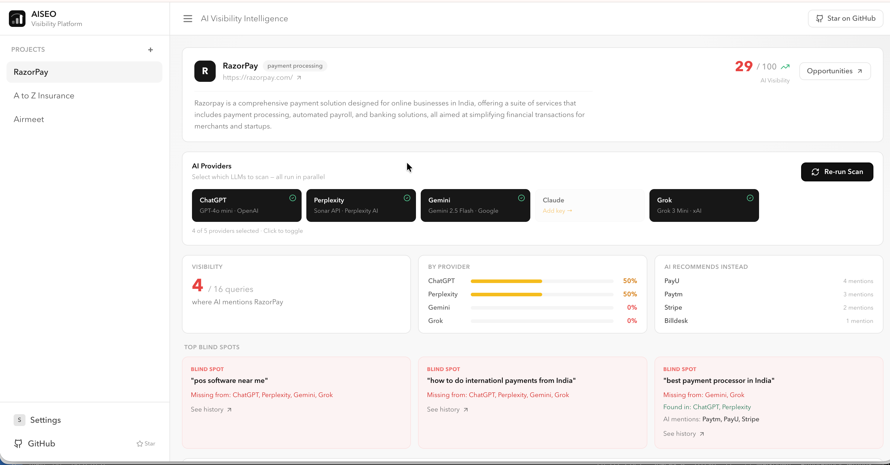
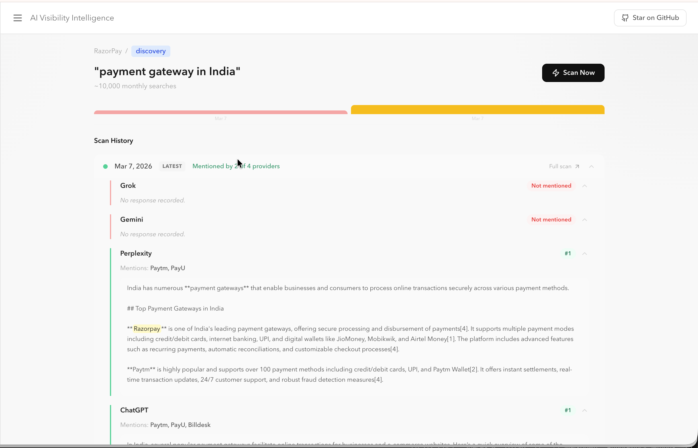
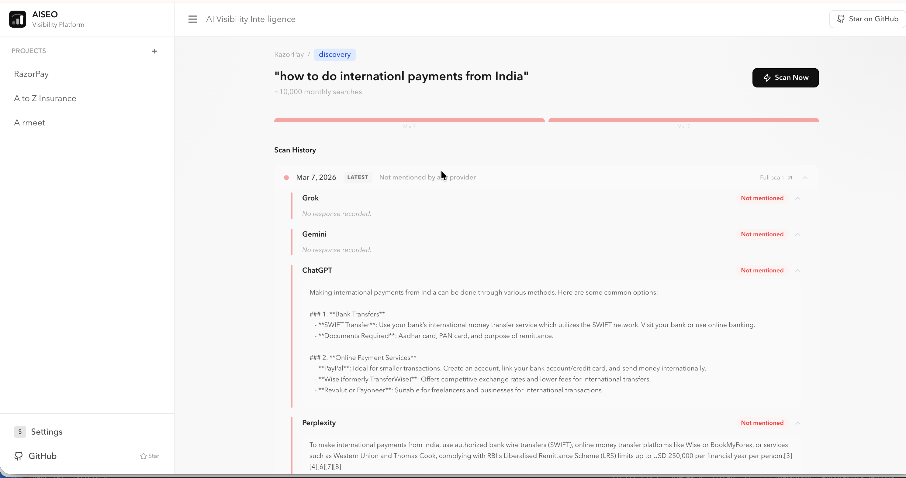
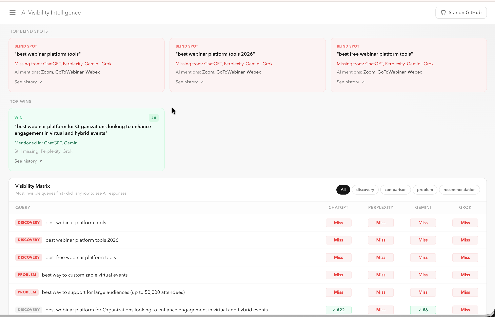

<div align="center">

### Open Source Generative Engine Optimization (GEO) Platform

**Track how ChatGPT, Perplexity, Gemini, Claude, and Grok talk about your product.**

[](https://opensource.org/licenses/MIT)
[](https://python.org)
[](CONTRIBUTING.md)

[Live Demo](https://github.com/dipakkr/ai-seo-platform) · [Report Bug](https://github.com/dipakkr/ai-seo-platform/issues) · [Request Feature](https://github.com/dipakkr/ai-seo-platform/issues)

</div>

---





---

## Why this exists

AI search is the new Google. When a buyer asks ChatGPT *"best project management tool for startups"*, they get a list — not a page of links. If you're not on that list, you're invisible to a growing share of your market.

Traditional SEO tools track Google rankings. **None of them track AI rankings.**

AI SEO Platform is the open-source fix. Paste your URL → get a full picture of how every major AI engine ranks your brand, which queries you're missing, and exactly which competitors are being recommended in your place.

---

## What it does

1. **Paste your URL** — auto-extracts your brand name, category, competitors, and key features
2. **Generates queries** — builds 50+ buyer-intent prompts across discovery, comparison, problem, and recommendation categories
3. **Scans 5 AI engines** — ChatGPT, Perplexity, Gemini, Claude, and Grok run in parallel
4. **Scores visibility** — 0–100 score weighted by search volume, broken down per engine and query type
5. **Surfaces opportunities** — ranks gaps by `search_volume × visibility gap` so you fix the highest-impact blind spots first

---

## Screenshots

**Provider selection & visibility scores**


**Blind spots + visibility matrix**


**Full sidebar with multiple projects**


---

## Quick Start

### Docker (recommended)

```bash
git clone https://github.com/dipakkr/ai-seo-platform.git
cd ai-seo-platform

cp .env.example .env
# Add at least one LLM API key — see .env.example

docker compose up
```

Open **http://localhost:3000**

### Local dev

```bash
# Backend
python -m venv .venv && source .venv/bin/activate
pip install -e ".[dev]"
python -m spacy download en_core_web_sm
uvicorn aiseo.main:app --reload

# Frontend (new terminal)
cd frontend && npm install && npm run dev
```

Open **http://localhost:5173** · API docs at **http://localhost:8000/docs**

---

## Configuration

Add your API keys to `.env`. You only need **one** to start — the platform scans whichever providers you configure.

```bash
AISEO_OPENAI_API_KEY=sk-...        # ChatGPT
AISEO_ANTHROPIC_API_KEY=sk-ant-... # Claude
AISEO_GOOGLE_API_KEY=AIza...       # Gemini
AISEO_PERPLEXITY_API_KEY=pplx-...  # Perplexity
AISEO_XAI_API_KEY=xai-...          # Grok
```

Keys can also be entered directly in the browser Settings page — they stay in `localStorage` and are never stored on the server.

---

## Provider Support

| Provider | Web Search | Notes |
|---|---|---|
| ChatGPT (GPT-4o mini) | ✓ Bing | Via OpenAI Responses API |
| Perplexity (Sonar) | ✓ Native | Most real-time results |
| Gemini (2.5 Flash) | ✓ Google Search grounding | Best for Google-indexed content |
| Claude (Sonnet) | ✗ | Reflects training data presence |
| Grok (Grok 3 Mini) | ✗ planned | xAI API, OpenAI-compatible |

---

## Stack

Python + FastAPI · React 18 + TypeScript · Tailwind CSS v4 · SQLite / PostgreSQL · Celery + Redis · spaCy + rapidfuzz · Docker Compose

---

## Contributing

```bash
git clone https://github.com/dipakkr/ai-seo-platform.git
cd ai-seo-platform
python -m venv .venv && source .venv/bin/activate
pip install -e ".[dev]"
```

Good first issues: new search volume adapters · multi-language mention detection · CSV export · email digests

Please open an issue before submitting a large PR.
